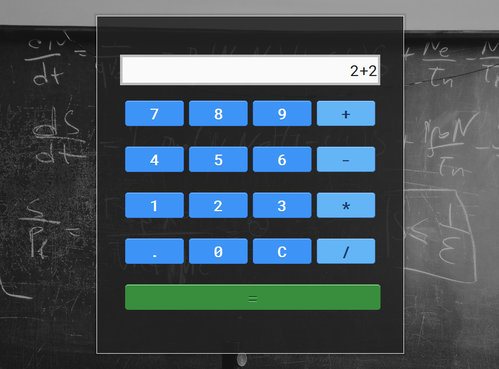

# FCC JavaScript-powered Calculator
A simple calculator powered by JavaScript

See it in action on [CodePen](https://codepen.io/andreydobra/pen/XgOgbN)

## Lessons learned

I really enjoyed this challenge as it pushed me a bit out of my comfort zone and forced me to learn some new things regarding CSS, JavaScript, and jQuery, not to mention actual design, as I experimented with multiple ideas before settling on the visual you see above.

I did a lot of trial and error to figure out different ways a user could break the application and, in order to keep things relatively simple, I settled with the `eval()` function in JavaScript, instead of writing my own operations.