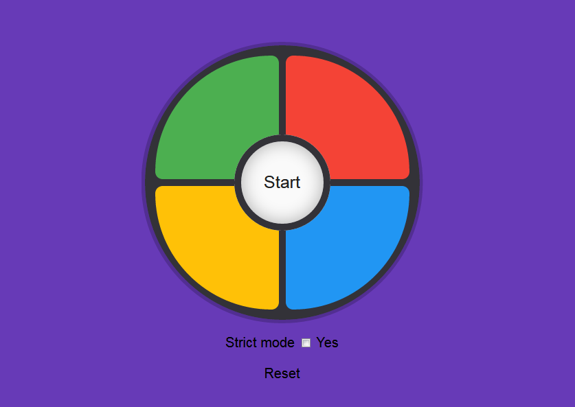

# FCC Simon Says Game
An entertaining Simon Says game

See it in action on [CodePen](https://codepen.io/andreydobra/pen/gRyyXN)

## Lessons learned

The TicTacToe project prepared me quite well for this exercise, as I applied the same basic strategy: build incrementally and keep on testing the things you're adding.

There were quite a few challenges, starting right with the design. I knew how to create circular divs but stacking them and making them look as intended is a whole other thing.

After the design was done, starting to build the mechanics also proved pretty challenging, even somewhat trivial things like adding a sound effect to each color div.

In the end, it's a weird feeling to describe: I feel extremely satisfied that, with the end of this project, my Front-End journey through FreeCodeCamp comes to a conclusion. I'll probably continue with the Data Visualization and Back-End certifications, as I'm still hungry for mroe.