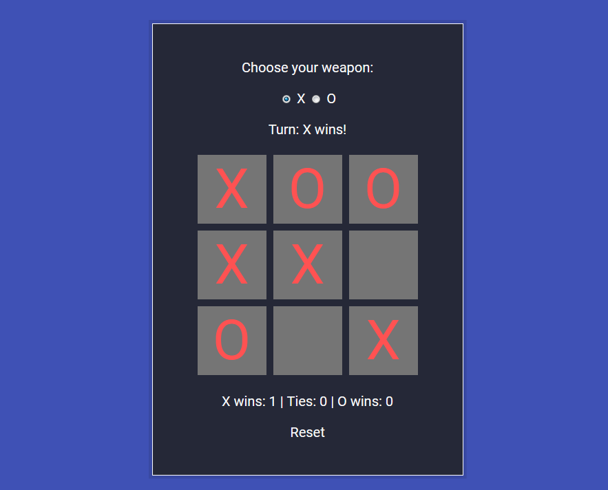

# FCC TicTacToe Game
An entertaining TicTacToe game

See it in action on [CodePen](https://codepen.io/andreydobra/pen/gRyyXN)

## Lessons learned

> How do you eat an elephant? One piece at a time.

This project was a lot of fun and really taught me the importance of building a major website with incremental steps.

I started making the basic design of the page and experimented with various grid layouts before settling on the divs you see above.

Then I implemented the functionality to mark the divs either with `X` or `O` and then to detect the actual wins and ties.

The most challenging part, however, was implementing the AI. I decided to build a simple AI that picks at random, thereby fulfilling the requirements set in place by FreeCodeCamp. I read about using the minMax algorithm or the strategy rules from Wikipedia's TicTacToe article but, in the end, I went with a simple, randomized AI.

It took a bit of trial and error and, after obtaining a working product, I started refactoring. If you look through the commit history, you'll see that I went with a brute force and tedious approach that hardcoded each win condition and each random case. Needless to say, this resulted in hundreds of lines of JavaScript code. But, after a bit of creative thinking, I managed to use arrays and make everything much more compact and less resource-intensive.