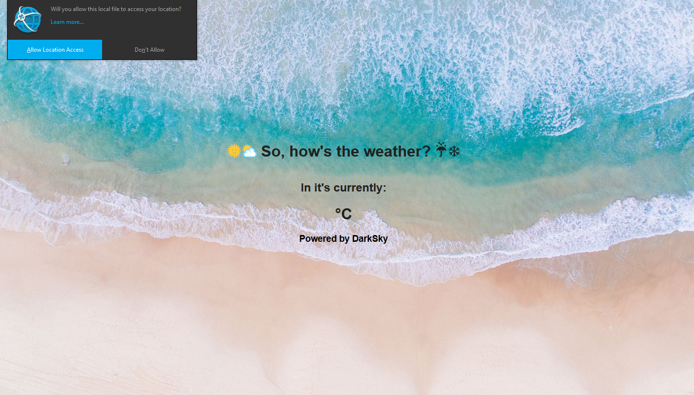

# FCC Weather App
A weather application that is capable of geolocation and forecast information

## Lessons learned

This application was certainly a clear example of easier said than done. I thought you just had to plug in some APIs, write a bit of JS, and then voila, everything worked as intended.

After many, many, many tabs with documentation, Stack Overflow, and probably one point where I thought about shutting everything down, the project came together and things started working.

<<<<<<< HEAD
The version on GitHub, of course, does not have my Google Maps and DarkSky API keys, so you'll have to take my word for it that everything works as intended 😏.
=======
The version on GitHub, of course, does not have my Google Maps and DarkSky API keys, so you'll have to take my word for it that everything works as intended 😀.
>>>>>>> 4c6cc7a08488dc83f39a5155df5b3c8a3acac2e7
