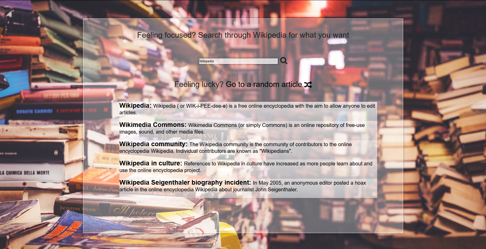

# FCC Wikipedia Viewer
A simple website that enables users to search through Wikipedia or go to a random page

## Lessons learned

Things progressed a bit more smoothly in this project, thanks to the experience from the weather application.

I did run into a few snags while trying to communicate with Wikipedia's API, especially with an attribute that needed to be appended onto the link to get it to work (`&origin=*`).

The CSS Flexbox and nesting the various boxes on the site also proved a bit tricky but I managed to triumph. Similarly, the Font-Awesome icons weren't lining up correctly, so after a few quick searches, I realized that they needed to be vertically alligned to the middle to work as intended.